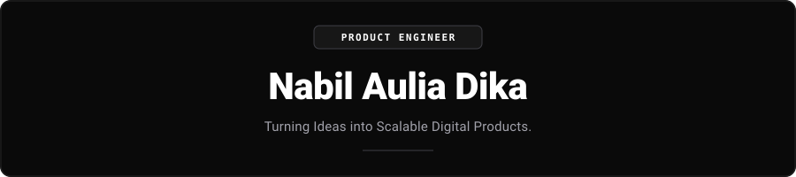
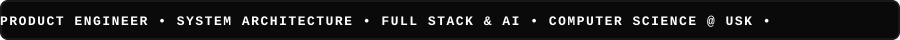
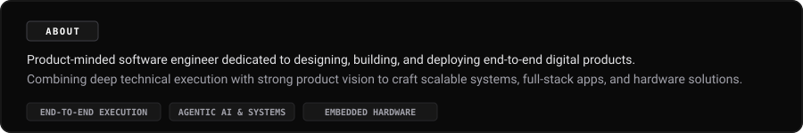
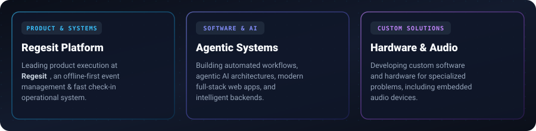
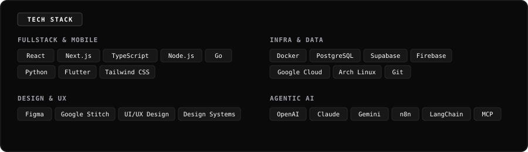
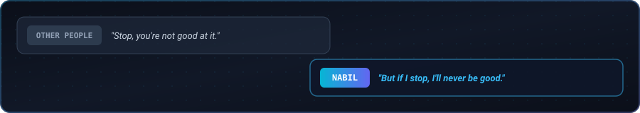
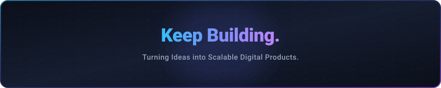

  

 

  

  

  

  

  

  

  

  

  
<b>ENGINEERING ACTIVITY</b>

<table align="center" width="100%">
  <tr>
    <td align="center" bgcolor="#0a0a0a">
      
    </td>
  </tr>
</table>

  

  
<b>GET IN TOUCH</b>

  
Open to tech discussions, product building, or collaborations.

  
  
  

   

  

   

  

